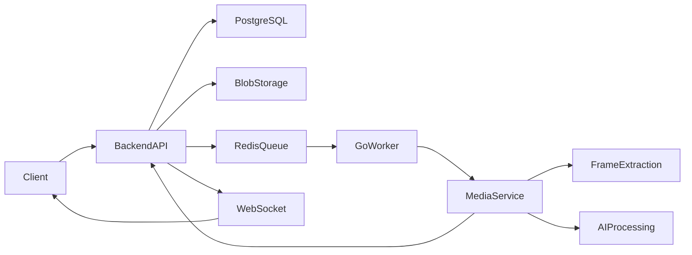

# FrameFlow

Distributed video processing platform with AI-powered summarization and asynchronous media pipelines.

## Overview

FrameFlow is a distributed backend platform designed to process video content asynchronously through scalable media pipelines.

The project explores concepts such as:

- Distributed systems
- Asynchronous processing
- Queue-based architectures
- AI/LLM integration
- Media processing pipelines
- Microservices communication
- Real-time updates with WebSockets

The main goal is to build a scalable architecture capable of receiving video uploads, extracting and processing frames, generating AI-powered summaries and delivering real-time processing updates to users.

---

## Architecture



---

## Services

### backend-api
Responsible for:

- Upload orchestration
- Job creation
- Metadata persistence
- API endpoints
- WebSocket updates
- Communication with Redis queues

### media-service
Responsible for:

- Video processing
- Frame extraction
- Media transformations
- AI preprocessing pipeline

### worker-go
Responsible for:

- Queue consumption
- Job orchestration
- Distributed task execution
- Pipeline coordination

---

## Tech Stack

### Backend
- Python
- FastAPI
- Go
- Redis
- PostgreSQL
- Docker

### Media & AI
- OpenCV
- Pillow
- AI/LLM pipelines (planned)

---

## Running locally

### Requirements

- Docker
- Docker Compose

### Start services

```bash
docker compose up --build
```

---

## Available Services

| Service | URL |
|---|---|
| Backend API | http://localhost:8000 |
| Backend Docs | http://localhost:8000/docs |
| Media Service | http://localhost:8001 |
| Media Docs | http://localhost:8001/docs |

---

## Project Structure

```text
frame-flow/
│
├── backend-api/
├── media-service/
├── worker-go/
├── docker-compose.yml
└── README.md
```

---

## Roadmap

### V1
- [x] Dockerized distributed architecture
- [x] Backend API service
- [x] Media processing service
- [x] Redis integration
- [x] PostgreSQL integration
- [ ] Video upload pipeline
- [ ] Job persistence
- [ ] Queue-based processing
- [ ] Frame extraction
- [ ] WebSocket real-time updates

---

## Goals

This project was created to deepen knowledge in:

- Distributed systems
- Backend architecture
- Asynchronous workflows
- AI engineering
- Scalable media pipelines
- Queue-driven systems
- Microservices communication
---

## Maintainer

Fernanda Ishida
