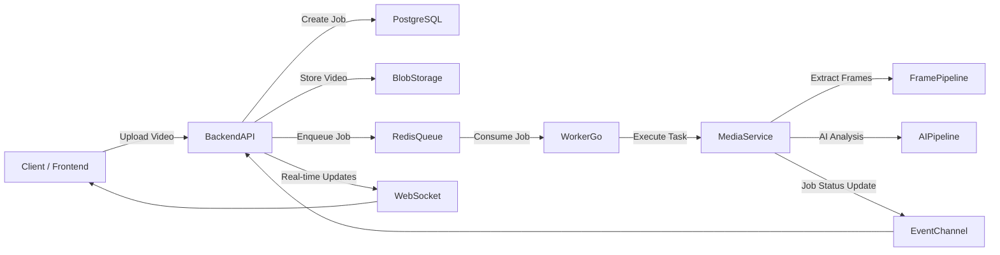

# FrameFlow

A distributed event-driven system for asynchronous video processing and AI-generated content summarization.

## Overview

FrameFlow is a distributed backend platform designed to process video content asynchronously through scalable media pipelines.

It focuses on exploring and applying real-world system design concepts such as:

Distributed systems design
Asynchronous job processing
Queue-based architectures
Event-driven communication
AI/LLM integration for content understanding
Media processing pipelines
Microservices communication patterns
Real-time updates via WebSockets

The system is designed to receive video uploads, process frames through background workers, generate AI-powered summaries, and deliver real-time status updates to clients.

---

## Architecture



---

## Services

### backend-api
Responsible for:

- Upload orchestration
- Job creation and lifecycle management
- Metadata persistence
- REST API endpoints
- WebSocket real-time updates
- Communication with the queue system
  
### media-service
Responsible for:

- Video processing
- Frame extraction
- Media transformations
- AI preprocessing and summarization pipeline

### worker-go
Responsible for:

- High-performance queue consumer responsible for distributed job execution and background processing coordination.

---

## Tech Stack

### Backend
- Python
- FastAPI
- Go
- Redis
- PostgreSQL
- Docker

### Media & AI
- OpenCV
- Pillow
- AI/LLM pipelines (planned)

---

## Running locally

### Requirements

- Docker
- Docker Compose

### Start services

```bash
docker compose up --build
```

---

## Available Services

| Service | URL |
|---|---|
| Backend API | http://localhost:8000 |
| Backend Docs | http://localhost:8000/docs |
| Media Service | http://localhost:8001 |
| Media Docs | http://localhost:8001/docs |

---

## Project Structure

```text
frame-flow/
│
├── backend-api/
├── media-service/
├── worker-go/
├── docker-compose.yml
└── README.md
```

---

## Roadmap

### V1
- Containerized distributed architecture
- Backend API service
- Media processing service
- Redis-based queue system
- PostgreSQL persistence layer
- Video upload pipeline
- Job lifecycle management
- Asynchronous job processing pipeline
- Frame extraction pipeline
- Real-time job status streaming via WebSockets

---

## Goals

This project was built to deepen understanding of:

- Distributed systems
- Backend architecture
- Asynchronous workflows
- AI-powered systems
- Scalable media processing pipelines
- Queue-driven systems
- Microservices communication
---

## Maintainer

Fernanda Ishida
